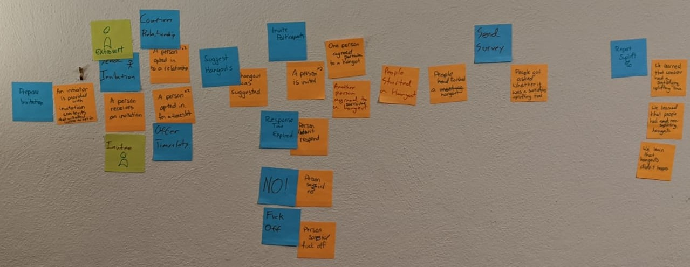

# CatchUpTo.Me

OK. I need to break work into tiny pieces so that we can do it in the few hours we find here and there.

This process needs to be maximally interruptible.

Moving from ideas to our heads to increasing concreteness, where code is the most concrete.

I want to get an outline of the bounded contexts, and a strong definition of the interfaces with confidence that it hangs together. (Like, an Alloy model)

Then within each bounded context, there can be user stories. User stories at the high level feel wrong to me, they're not specific enough.

Avdi says, is this BDUF? Maybe. But we don't have the luxury of designing implicitly in our heads on this one.

## Notes

copied from Roam:

- Also known as #missyourface
- This is for the app Avdi and I are building, to do scheduling of catchups
- #universalLanguage definitions
    - Friendship: agreement between two people (friends) that they would like to catch up to each other randomly sometimes.
    - catchup: a randomly initiated meeting suggestion for one friendship in a timeslot where each friend is free.
    - BFF: a person who would like to participate in a friendship. They sent invitations, accepted at least one invitation, or both.
    - Initiator: the participant in a catchup responsible for suggesting the place to meet.
    - Suplift: (n) a satisfying and uplifting experience
(v) to create a satisying and uplifting experience for both participants, which strengthens the friendship
    - Timeslot: weekly time period when a person is usually available for a catchup
- Goal: strengthened friendships
    - through intermittent catchups
    - with no coordination work. (or, minimized)
- #NorthStar Metric = Suplifts per week.
    - 1 suplift per catchup where at least one participant later reported suplift
- Funnel (from goal to inputs):
    - Suplifts
    - Survey Answers
    - Catchups
    - Overlapping Timeslots
    - Friendships, Timeslots
    - Invitations (invisible at first)
    - BFFs
- #timezones are core to this app. We will handle them from the start.
- Invitations.
    - Initially, the app can provide a link to a BFF that they can send to other people.
    - the invitation link will encode who the invitation is FROM, but it won't know who it's to. The BFF can send it to anyone.
    - Anyone who clicks on the link can enter their name (optional) and email (required) and time zone (defaulted to browser's current)
    - After they accept that, we'll ask them about timeslots.

## More things that are hard to remember

### How do I change this page

The top-level layout is in `application.html.erb`

We do have a CSS framework. it is Bulma. 

